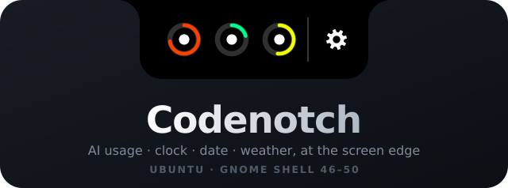
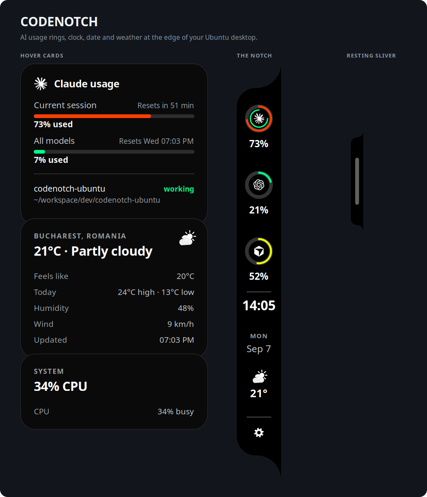
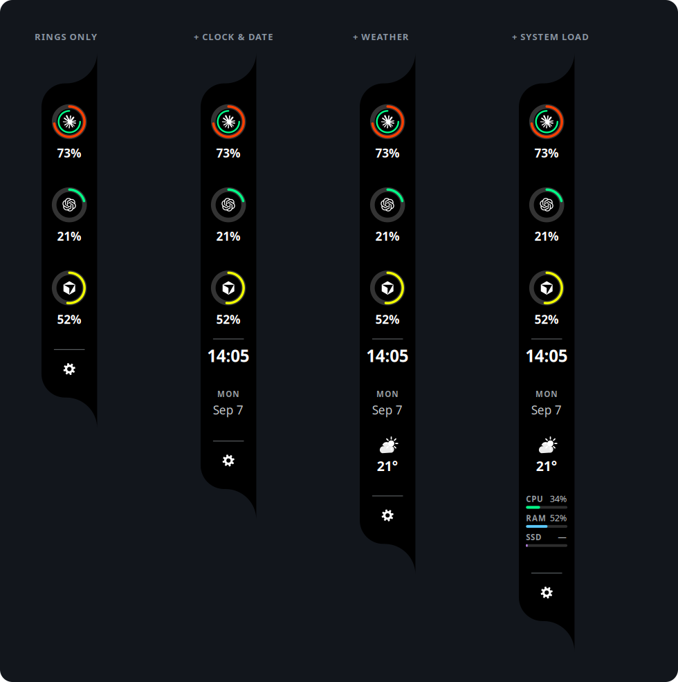
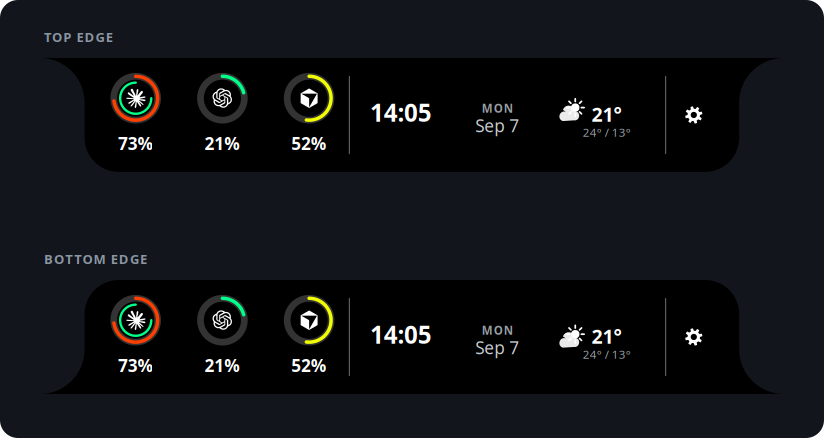
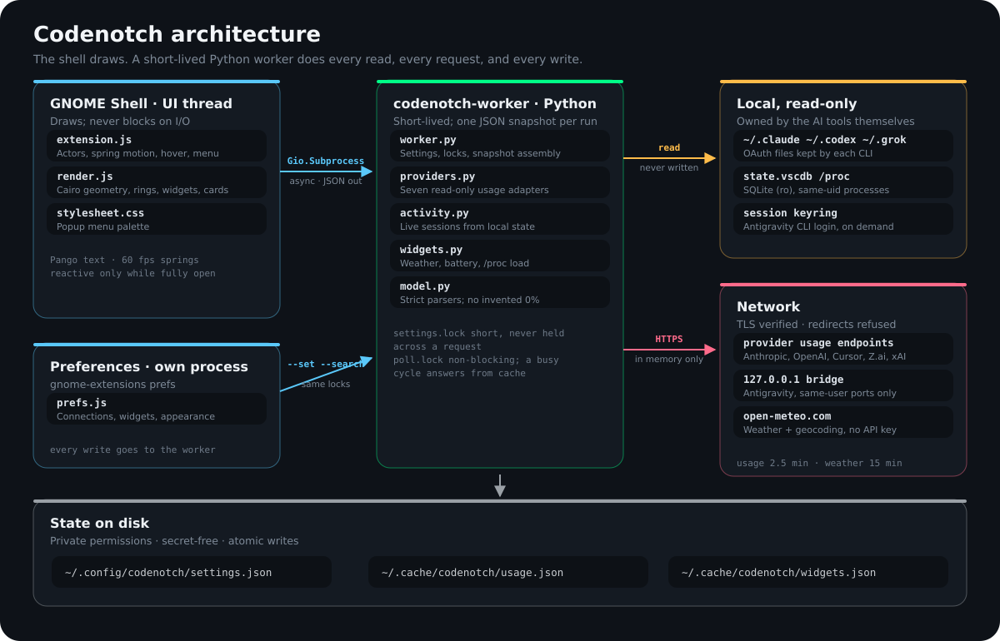

<div align="center">



# Codenotch for Ubuntu

**Your AI allowances, the time, and the weather — folded into the edge of your screen.**

A GNOME Shell adaptation of [vinzdg/codenotch](https://github.com/vinzdg/codenotch): the black
silhouette, the inverse corners, the 44-unit usage rings. Plus a settings gear in its own cell,
widgets, spring animation, and a resting sliver so you always know it is there.

[](https://ubuntu.com/)
[](https://gjs.guide/extensions/)
[](https://wayland.freedesktop.org/)
[](https://www.python.org/)
[](https://gjs.guide/)
[](LICENSE)

[**github.com/bogdancstrike/codenotch-ubuntu**](https://github.com/bogdancstrike/codenotch-ubuntu)  ·  made by **Bogdan D**



</div>

---

```bash
sudo apt install ./dist/codenotch_0.2.0_all.deb   # then log out and back in
gnome-extensions enable codenotch@ubuntu.local
```

**Explore:** [What it does](#what-it-does) · [Install](#install) · [Widgets](#widgets) ·
[Settings](#settings) · [Providers](#supported-ais) · [Architecture](#how-it-works) ·
[Privacy](#polling-and-privacy) · [Build](#build-from-source) · [Troubleshooting](#troubleshooting)

## What it does

**It answers "how much have I used?" without you asking.** Every signed-in AI CLI gets a
ring at the screen edge — Claude, Codex, Cursor, Antigravity, GLM, Grok, OpenCode. Green
below 50%, yellow at 50, orange at 70. Hover a ring for every allowance window, when it
resets, and which of your sessions are running right now.

**It never invents a number.** A provider that returns nothing shows a dash, not `0%`. A
request that fails leaves the last real reading on screen and says how old it is. A
provider you switch off is not polled, not read, and not detected — the enablement check
happens *before* any credential is touched.

**It is a desktop widget too.** Clock, date, weather, battery and system load live in the
same notch, after your rings and before the gear. The clock and date never leave the shell;
the weather is one request every fifteen minutes.

**It stays out of the way.** At rest it is a sliver at the edge with a small light handle.
Hover and it springs open — a real spring, so interrupting it mid-animation continues from
where it was instead of restarting. Leave and it folds back.

**It cannot take your desktop with it.** While folded, the actor is sliver-sized and not
clickable. Reactivity follows the drawing, never the intent. A pointer guard folds anything
left open once a second. The popup menu is always closed before it is rebuilt or destroyed.

<div align="center">

<br><em>Rings only, or add exactly the widgets you want.</em>
</div>

## Install

Ubuntu 24.04 with GNOME Shell 46 is the primary target; 47–50 are declared and want desktop
validation. Wayland or Xorg. No Node, npm, pip, Electron, or Docker is needed to run the
package.

```bash
gnome-shell --version                          # expect 46 or newer
echo "$XDG_CURRENT_DESKTOP / $XDG_SESSION_TYPE"

sudo apt update
sudo apt install ./dist/codenotch_0.2.0_all.deb
```

**Log out of Ubuntu and log back in once.** This lets GNOME discover the newly installed
system extension; on Wayland, restarting a terminal is not a substitute. Then, as your
normal user and without `sudo`:

```bash
gnome-extensions enable codenotch@ubuntu.local
```

A sliver appears on the right edge of your primary display. Hover it to unfold. Settings
open from the gear after the divider, the top-panel icon, the launcher entry
**Codenotch Settings**, or:

```bash
codenotch settings
```

## Widgets

Turn any of these on in **Settings → Widgets**. They are drawn in this order, after your
AI rings and before the gear, separated by a divider.

| Widget | Shows | Cost |
| --- | --- | --- |
| **Clock** | 24- or 12-hour time, optional seconds | None — drawn from the local clock |
| **Date** | Weekday and day, in three styles | None |
| **Weather** | Condition symbol and temperature; hover for feels-like, high/low, humidity, wind | One request per 15 minutes |
| **Battery** | Charge and charging state; hides itself on desktops | A `/sys` read |
| **System load** | CPU and memory meters | Two `/proc` reads |

Weather uses [Open-Meteo](https://open-meteo.com/): no account, no API key, and no
identifiers are sent — just the coordinates of the place you pick. Search for a city in
settings and choose it; Celsius/km-h and Fahrenheit/mph are both available. Click the
weather cell in the notch to refresh it immediately.

A location is a name **and** its coordinates, so it is stored in one write
(`codenotch location …`, or the search results in settings). Half of one is not a
location and is discarded on read — there is no state where the settings window names a
city the notch cannot use.

## Settings

Three pages, all native libadwaita.

**Connections** — a row per AI with its usage source, connection status, allowance windows,
last successful reading, and a **Verify** button that actually performs the request.
Usage refresh (60 s to 10 min, default 2½ min), idle refresh, demo mode, and *Verify all*.

**Widgets** — the five widgets above, clock format and seconds, date style, weather location
search, and units.

**Appearance** — visibility (on hover / always / hidden), the resting sliver, screen edge
(right, left, top, bottom), monitor, size (75%–200%), top-panel icon, hiding over fullscreen
windows, and **text contrast** in three tiers.

<div align="center">

<br><em>All four edges share one drawing path.</em>
</div>

## Supported AIs

| AI | Linux usage source | Setup |
| --- | --- | --- |
| **Claude Code** | `~/.claude/.credentials.json` → Anthropic OAuth usage endpoint | Run `claude` and sign in. Extra `~/.claude-<name>` profiles get their own ring when they hold a login or settings of their own |
| **Codex** | `~/.codex/auth.json` → ChatGPT usage endpoint | `codex login` with your ChatGPT account; an API-key-only login exposes no allowance |
| **Cursor** | `~/.config/Cursor/.../state.vscdb` → Cursor usage summary | Sign in inside Cursor. SQLite is opened read-only, WAL included |
| **Antigravity** | Running language server (IDE or `agy` CLI) → local quota RPC; otherwise the `agy` keyring login | Start Antigravity or run `agy`. If Google will not publish the allowance to another app, that is stated plainly |
| **GLM** | Z.ai Coding Plan key in Claude Code, OpenCode, or ZCode | Configure a Z.ai or BigModel plan; the key only ever goes to its matching endpoint |
| **Grok** | `~/.grok/auth.json` → Grok CLI billing credits | `grok login`. Only xAI-issued sessions are accepted |
| **OpenCode** | `~/.local/share/opencode/auth.json` → OpenCode Go usage | Sign in to the Go plan |

`XDG_CONFIG_HOME`, `XDG_DATA_HOME`, `XDG_CACHE_HOME`, `CLAUDE_CONFIG_DIR` and `CODEX_HOME`
are respected when GNOME Shell inherits them. These are the endpoints upstream uses; many
are internal provider APIs and their shapes can change.

## How it works

<div align="center">

</div>

GNOME Shell draws and never waits. A short-lived Python worker does every read, every
request and every write, and answers with one secret-free JSON snapshot. Settings take a
short lock that is never held across a request; polling takes a separate **non-blocking**
lock, so a slow provider can never make the preferences window — or a settings change —
hang behind it.

Full write-up: **[docs/architecture.md](docs/architecture.md)** · porting notes:
[docs/PORTING.md](docs/PORTING.md) · validation: [docs/TEST-REPORT.md](docs/TEST-REPORT.md).

## Technologies

| Layer | Built with |
| --- | --- |
| Shell integration | GJS, GNOME Shell 46–50 extension API, `St`, `Clutter`, `Gio.Subprocess` |
| Drawing | Cairo through `St.DrawingArea`; **Pango** for text metrics and hinting |
| Motion | A hand-rolled spring integrator (position + velocity), 60 fps, interruptible |
| Preferences | libadwaita 1.5 / GTK 4 |
| Worker | Python 3.12 standard library only — `urllib`, `ssl`, `sqlite3`, `fcntl`, `concurrent.futures` |
| Weather | Open-Meteo forecast and geocoding APIs |
| Credentials | Files owned by each AI tool, plus libsecret for the Antigravity CLI |
| Packaging | `dpkg-deb`, `Architecture: all` (amd64 and arm64) |
| Docs images | The extension's own renderer, rasterised with gjs + librsvg |

No web server, telemetry endpoint, token vault, background daemon, or account.

## Polling and privacy

- Usage is requested every **2½ minutes** while a session of that AI is running, every
  **10 minutes** otherwise, and both are configurable. Weather is capped at once per
  15 minutes. The clock costs nothing.
- Credentials are read from the owning tools and used in memory. Codenotch does not save,
  rotate, refresh, or log tokens. Redirects are refused so a borrowed credential is never
  forwarded.
- Remote TLS certificates are verified. The only exception is the Antigravity bridge on
  `127.0.0.1`, restricted to ports discovered from a same-user Antigravity process.
- HTTP 429 triggers persisted exponential backoff from 60 s; a longer `Retry-After` wins.
  Manual verification cannot bypass an active rate-limit deadline.
- Settings and non-secret cached readings live in `~/.config/codenotch/` and
  `~/.cache/codenotch/` with private permissions. Snapshots never contain tokens.
- Switching an AI off stops its credential reads, clears its cached readings, and removes
  its ring. It does not sign you out of anything.

## Command line

```bash
codenotch status                 # cached status as JSON; contacts nobody
codenotch verify claude          # verify one provider…
codenotch verify all             # …or every enabled one
codenotch weather                # force a widget refresh
codenotch search "cluj napoca"   # geocode a weather location
codenotch set pollSeconds 300    # any setting, as JSON
codenotch location '{"label":"Cluj","latitude":46.77,"longitude":23.6}'
codenotch demo true              # sample data, no credentials, no network
codenotch settings               # open preferences
codenotch disable / enable
codenotch --update               # rebuild and reinstall from this checkout
```

### Updating from source

From anywhere inside the source directory:

```bash
codenotch --update            # or: codenotch --update ~/src/codenotch-ubuntu
```

It finds the checkout by walking up from the current directory, syntax-checks the
extension and compiles the worker, builds the `.deb`, installs it (via `pkexec` or
`sudo`), re-enables the extension, and tells you whether you need to log out or can
reload the shell in place. The worker and the settings window are live immediately;
only the extension's own code waits for a new session on Wayland.

Output is JSON containing usage and status, never tokens. Per-profile Claude IDs appear as
`claude:.claude-work`.

## Build from source

```bash
sudo apt install python3 dpkg-dev
make deb                         # tests + syntax checks + dist/codenotch_0.2.0_all.deb
```

Individual steps:

```bash
PYTHONPATH=backend python3 -m unittest discover -s tests -v   # 43 backend tests
node tests/test-layout.mjs                                    # geometry, widgets, springs
make check                                                    # syntax + bytecode

gjs -m scripts/render-shell-preview.js   # README images through the real Pango path
node scripts/render-preview.cjs          # same renderer, SVG adapter, no GNOME needed
```

`scripts/render-shell-preview.js` is also the cheapest smoke test there is: it runs
`render.js` and the Pango text engine exactly as GNOME Shell does. If it produces a PNG,
the drawing code loads and draws.

## Troubleshooting

**“Extension does not exist” after installing** — log out and back in, then
`gnome-extensions enable codenotch@ubuntu.local`.

**No notch** — `codenotch settings`, set visibility to *Always show* and monitor to
*Primary display*; leave Activities and fullscreen. Check the global switch in the
Extensions app.

**An AI says “Sign-in needed”** — open that tool and confirm it is signed in. Expired tokens
are refreshed by the owning tool, not by Codenotch. Antigravity must be running for its
local quota service.

**Extension errors**

```bash
journalctl --user -b -o cat | grep -i codenotch
```

Diagnostics JSON can contain local project names in session rows; review before sharing.

## Upgrade or uninstall

```bash
codenotch --update                                # from a source checkout
sudo apt install ./dist/codenotch_0.2.0_all.deb   # or install a built package
codenotch disable && sudo apt remove codenotch
rm -rf ~/.config/codenotch ~/.cache/codenotch     # optional: erase local state
```

## Limitations

This is an Ubuntu port, not a claim of 1:1 macOS parity. Ubuntu's system sans-serif
substitutes for SF Pro. macOS hardware-notch integration and Sparkle updates are out of
scope. Automated coverage is described in [docs/TEST-REPORT.md](docs/TEST-REPORT.md); the
desktop acceptance checklist in [docs/PORTING.md](docs/PORTING.md) still applies.

## About

Made by **Bogdan D** — [github.com/bogdancstrike/codenotch-ubuntu](https://github.com/bogdancstrike/codenotch-ubuntu)

Settings and cached readings live in `~/.config/codenotch/` and `~/.cache/codenotch/`, so
your AI selection, widgets, and weather location survive package updates, reinstalls, and
`codenotch --update`. Removing the package leaves them in place; delete those two
directories to erase them.

## License

MIT. Original artwork, geometry, and source-derived behavior © 2026 Vinz; the original
[`LICENSE`](LICENSE) is retained. The Ubuntu port is by Bogdan D and is not an
official upstream release.
